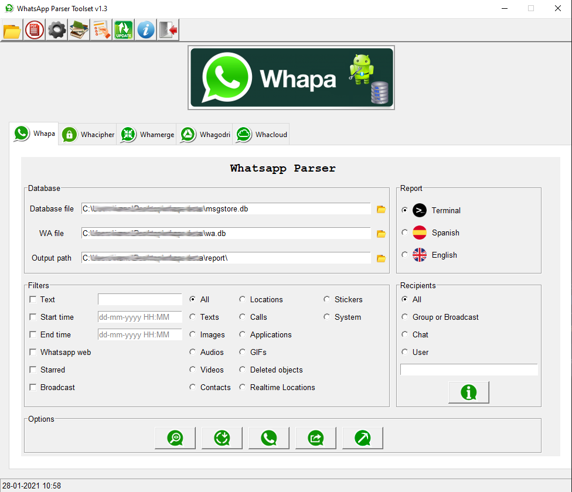

  

Whatsapp Parser Toolset
====
Version 2.00 · July 2026

A set of forensic tools to analyze WhatsApp on **Android and iOS** devices.
Written in Python 3.11 and tested on Linux, Windows and macOS.

Each tool does one job and can be used on its own from the command line, or all
of them together from the graphical interface.

**Android**
- **Whapa** — database parser (current and legacy schema)
- **Whacipher** — decryption and encryption (crypt12, crypt14 and **crypt15**)
- **Whagodri** — Google Drive backup extractor
- **Whamerge** — database merger
- **Whachat** — exported chat parser

**iPhone**
- **Whapa** — `ChatStorage.sqlite` parser *(new in this version)*
- **Whacloud** — iCloud extractor
- **Whachat** — exported chat parser

---

What's new in 2.00
====

WhatsApp changed its database layout back in 2021, which is why older releases
stopped returning anything useful. This version reads the current Android schema
as well as the legacy one, adds **iOS support**, decrypts **crypt15**, and
recognises the message types added since: polls, video notes, view-once media,
events, albums, edits, reactions, channels and communities.

It also brings a proper search engine (regular expressions, dates, sender,
direction, type and flags), a printable report and CSV export, and an
interactive report that no longer chokes on very long conversations.

Full detail in the [changelog](doc/CHANGELOG.md).

---

Installation
====

You need **Python 3.11 or later**. Check with:

	python3 --version

Clone the repository:

	git clone https://github.com/B16f00t/whapa.git && cd whapa

Then install the requirements. **Linux or macOS:**

	pip3 install --upgrade -r ./doc/requirements.txt

**Windows:**

	pip install --upgrade -r .\doc\requirements.txt

Or open the graphical interface and press **Install requirements** in the top
bar. It uses the same Python that is running the interface, so the tools and
their dependencies always end up in the same place — which is the usual cause of
"I installed it and it still says the module is missing".

	python3 whapa-gui.py

If you only need the command line and are not going to touch Google Drive or
iCloud, this is enough:

	pip3 install pycryptodome colorama

Every tool tells you what it needs. If something is missing you get a line like
this instead of a traceback:

	[e] Missing requirements for whacloud: pyicloud

	    Install just what is missing:
	        pip3 install --upgrade pyicloud

	    Or install everything:
	        pip3 install --upgrade -r "/path/to/whapa/doc/requirements.txt"

Getting started
====

**1. Get the database.** If it is encrypted, decrypt it first:

	python3 libs/whacipher.py -f msgstore.db.crypt15 -d key -o msgstore.db

The key can be the `key` file, `encrypted_backup.key`, or the 64 hexadecimal
characters of the root key. The format is detected automatically.

**2. See what is inside:**

	python3 libs/whapa.py msgstore.db -i 3

**3. Build the report:**

	python3 libs/whapa.py msgstore.db -m -a -wa wa.db -r EN -o ./report

Open `report/report/index.html` by double-clicking it. No web server needed.

On iOS it works exactly the same, just point at the other file:

	python3 libs/whapa.py ChatStorage.sqlite -m -a -r EN -o ./report

---

The graphical interface
====

	python3 whapa-gui.py

There is one tab per tool. Fill in the fields, press the button, and the output
appears below in real time. The top bar has:

- **Install requirements** — installs `doc/requirements.txt` with the same Python
  that runs the interface.
- **Settings** — edits `cfg/settings.cfg` without leaving the app: case details
  (which end up on the report cover) and the Google Drive and iCloud credentials.
- **Manual** — opens this file.
- **Español / English** — switches the interface language. The interface does not do any work itself: it builds
the command and calls the matching tool in `libs/`, so what you see in the panel
is exactly what you would get from the console.

---

Searching and filtering
====

You can filter from the command line, from the graphical interface, or inside
the report itself. All three use the same engine, so the same criteria always
return the same result.

| I want to… | Add |
|---|---|
| Search for text | `-t "transfer"` |
| Use a regular expression | `-t "transfer\w+" -re` |
| Match whole words only | `-ww` |
| Match case | `-cs` |
| A specific chat | `-u 34123456789` or `-g 1234-5678@g.us` |
| A specific sender | `-sn 34600111222` |
| A date range | `-ts "01-01-2024 00:00" -te "30-06-2024 23:59"` |
| Only sent or received | `-d sent` / `-d received` |
| Only deleted | `-td` |
| Only starred | `-s` |
| Only with an attachment | `-md` |
| Only forwarded or edited | `-fw` / `-ed` |
| Only with coordinates | `-gp` |
| Only messages recorded as read | `-lr` |
| Only messages with no read receipt | `-lu` |
| Only sent from WhatsApp Web | `-w` |
| A specific type | `-ti` image, `-ta` audio, `-tv` video, `-tn` poll, `-tq` view once… |
| A specific type code | `-rt 66,112` |

A full example:

	python3 libs/whapa.py msgstore.db -m -a -wa wa.db \
	    -t "transfer\w+" -re -d received \
	    -ts "01-01-2024 00:00" -te "30-06-2024 23:59" \
	    -r EN -p -x -o ./case

That produces the interactive report, the printable one and the CSV in a single
run, all containing the same messages.

Inside the report, the **Filters** button opens the same search, with the option
to search one chat or every chat at once. Results can be printed or exported to
CSV from there.

---

Attachments: getting the files into the report
====

This is the part people get wrong most often, so it is worth being explicit.

**A WhatsApp database does not contain any photos, audio or videos.** It only
stores the *path* where each file used to live on the phone, for example
`/storage/emulated/0/WhatsApp/Media/WhatsApp Images/IMG-20240115-WA0001.jpg`.
The same is true of an exported chat: the `.txt` only names the files.

So if you want to see the pictures and play the audio inside the report, you
have to **copy the files off the device yourself** and tell whapa where you put
them.

### 1. Copy the folder off the phone

Copy the whole `WhatsApp` folder from the handset, keeping its structure:

	WhatsApp/
	  Media/
	    WhatsApp Images/
	    WhatsApp Audio/
	    WhatsApp Video/
	    WhatsApp Documents/
	    WhatsApp Voice Notes/
	    WhatsApp Stickers/

On iOS the equivalent lives under `Message/Media/`. Either layout works.

If you exported a chat from the app instead, the attachments come in the same
folder as the `.txt` file. Nothing to do: that folder *is* the media folder.

### 2. Point whapa at it with `-mp`

	python3 libs/whapa.py msgstore.db -m -a -r EN -mp /path/to/WhatsApp -o ./report

Now images appear inline, audio and video play in place, and documents become
links.

### 3. Decide whether to copy the files into the report

Without `-cm`, the report **links** to the files where they are. The report and
the media folder must then travel together, and if you move one the links break.

With `-cm`, the attachments are **copied into the report folder**, so the whole
thing is one self-contained package you can zip and hand over:

	python3 libs/whapa.py msgstore.db -m -a -r EN \
	    -mp /path/to/WhatsApp -cm -o ./report

	./report/
	  report/
	    index.html      <- open this
	    data/           <- the messages
	    media/          <- the attachments, copied here

Use `-cm` for anything you are going to deliver. Leave it off while you are
still working, to avoid duplicating gigabytes.

### What happens when a file is not there

Files get deleted, or the copy is partial. whapa does not hide that: the message
still appears, marked **not located**, and the path recorded in the database is
shown next to it. The run tells you the tally:

	Adjuntos: 412 localizados, 37 no encontrados (copiados al informe)

The path from the database is always displayed, whether the file was found or
not. What the report shows is what the database says, not what happened to be on
your disk.

### Matching is forgiving

WhatsApp writes those paths differently depending on version and platform, so
three attempts are made, in order: the relative path from `Media/` or `Message/`,
the path exactly as recorded, and finally the file name against an index of the
whole folder. That last one covers folders that have been reorganised on the way
out of the phone.

Read receipts
====

Reports show the delivery state of every message: *sent but still on the phone*,
*delivered to the server*, *delivered to the recipient*, *read by the recipient*,
*played* (for voice notes and view-once media). In the interactive report it
appears as a badge in the message footer, with a double tick when the message
was opened. In group chats, the per-participant receipts are counted, so a
message reads *delivered to 12, read by 7*.

`-lr` restricts the run to messages recorded as read, `-lu` to those without a
read receipt.

> **Read this before drawing conclusions.** The absence of a read receipt does
> **not** prove the message was never read. WhatsApp lets anyone turn read
> receipts off in its privacy settings; when they do, the state never goes past
> *delivered* no matter how many times the message was opened. Read receipts are
> also always off for broadcast lists. What the database records is what the
> sending device was told, not what the recipient actually did.
>
> The same caution applies in reverse in groups: read receipts there cannot be
> disabled, so a group message does carry per-participant read information.

Locations
====

Location messages show the coordinates, a live-location badge where it applies,
and links to open the point in Google Maps or OpenStreetMap.

**The report never loads a remote map on its own.** A report that asks a third
party for an image every time it is opened leaks the coordinates of your case and
stops working offline. Clicking a link is a deliberate act; a silent request is
not. If you do want the maps inside the report, `-gm` downloads them once while
the report is being generated and stores them in the folder, so the result stays
self-contained:

	python3 libs/whapa.py msgstore.db -m -a -r EN -gm -o ./report

Locations can also be exported to **KML** with `-k`, ready to open in Google
Earth or QGIS. Each placemark carries the timestamp, the chat, the direction, the
message type and its code, so the points can be read in context:

	python3 libs/whapa.py msgstore.db -m -a -gp -k -o ./report

`-gp` restricts the run to messages that carry coordinates.

The reports
====

**Interactive report** (`-r EN` or `-r ES`). Browsed like a conversation. It is
built to cope with very large chats: the messages are not inside the HTML but in
separate files loaded as you scroll down. A 150,000-message conversation opens in
under a second and the browser does not choke, because only the part you are
looking at is kept in memory.

**Printable report** (`-p`). A separate document, laid out as a table, meant for
paper or PDF. Every message is numbered so it can be cited, and the cover page
carries the case details, the search criteria used, and the SHA-256 of the source
files.

> **Important:** the interactive report does not print properly with `Ctrl+P`,
> because only part of the messages are loaded on screen at any time. To print,
> use `-p`, or the **Print chat** button inside the report, which loads
> everything before sending it to the printer.

Reckon on about 45 messages per A4 page. A 20,000-message chat is roughly 444
sheets, so it is worth filtering by date or by chat before printing.

**CSV** (`-x`). One row per message with 18 columns: date, chat, sender,
direction, type and its code, flags, coordinates, message ID and the inferred
sending device.

Case details (reference, unit, examiner) are filled in `cfg/settings.cfg` and
appear on the cover page.

---

The tools, one by one
====

Every tool answers `-h` with its full option list. What follows is what each one
is for and how it is normally used.

### whapa.py — the database parser

The main tool. Takes a decrypted database and lets you query it, filter it and
report on it.

	# What chats are in here?
	python3 libs/whapa.py msgstore.db -i 3

	# Status messages, call log
	python3 libs/whapa.py msgstore.db -i 1
	python3 libs/whapa.py msgstore.db -i 2

	# Message types this version does not know about yet
	python3 libs/whapa.py msgstore.db -i 4 -wa wa.db

	# A conversation, on screen
	python3 libs/whapa.py msgstore.db -m -u 34123456789 -wa wa.db

	# Everything, as an interactive report, with attachments
	python3 libs/whapa.py msgstore.db -m -a -wa wa.db \
	    -mp /path/to/WhatsApp -cm -r EN -o ./report

	# Copy the referenced attachments out, with an index
	python3 libs/whapa.py msgstore.db -e -mp /path/to/WhatsApp -o ./out

	# Carving of deleted records (uses libs/undark)
	python3 libs/whapa.py msgstore.db -c -o ./out

`-o` sets where the report is written. Without it, the report goes to the folder
you are standing in, and the run tells you which one — it never lands inside
`libs/`. From the graphical interface, leaving the output field empty puts it in
the whapa folder.

`-wa` adds the contact names from `wa.db` (Android) or `ContactsV2.sqlite` (iOS),
so chats show names instead of bare numbers. iOS databases are detected on their
own; `--platform` forces it if you need to.

### whacipher.py — decryption and encryption

	# Decrypt (crypt12, crypt14 and crypt15, detected automatically)
	python3 libs/whacipher.py -f msgstore.db.crypt15 -d key -o msgstore.db

	# With the root key as 64 hex characters
	python3 libs/whacipher.py -f msgstore.db.crypt15 -d <64_hex> -o msgstore.db

	# A whole folder at once
	python3 libs/whacipher.py -p ./backups -d key -o ./decrypted

	# Encrypt back to crypt15
	python3 libs/whacipher.py -f msgstore.db -e key -o msgstore.db.crypt15

The key can be the `key` file (158 bytes), `encrypted_backup.key`, or the 64
hexadecimal characters of the root key.

### whachat.py — exported chats

For chats exported from the app (Settings → Chat → Export chat). Since version
2.00 it produces **the same reports as whapa.py**: the interactive viewer, the
printable document and the CSV, with the same filters and the same attachment
handling.

	# Who is in this chat?
	python3 libs/whachat.py chat.txt -p

	# Full report; attachments are picked up from the chat's own folder
	python3 libs/whachat.py chat.txt -u "Your Name" -s android -r EN -o ./report

	# Printable and CSV as well, copying the attachments in
	python3 libs/whachat.py chat.txt -u "Your Name" -s android \
	    -r EN -pr -x -cm -o ./report

	# Search inside the chat
	python3 libs/whachat.py chat.txt -u "Your Name" -s android \
	    -t "transfer\w+" -re -r EN -o ./report

`-u` is your own name **exactly as it appears in the export**, so the tool knows
which messages are yours. `-s` is the platform the chat was exported from. `-mp`
is only needed if you moved the attachments away from the `.txt`.

An exported chat carries less than a database: there are no message IDs, no
deleted messages, no reactions, no quotes and no coordinates. The report shows
what is there and does not invent the rest.

### whamerge.py — merging databases

Combines several `msgstore.db` files into one, useful when you have backups from
different dates and want the fullest possible history.

	python3 libs/whamerge.py ./folder_with_databases -o msgstore_merged.db

### whagodri.py — Google Drive

Downloads backups from the Google account tied to the handset. Credentials go in
`cfg/settings.cfg`, section `[google-auth]`, or through the **Settings** button
in the interface.

	python3 libs/whagodri.py -i          # what backups exist
	python3 libs/whagodri.py -lw         # list the WhatsApp ones
	python3 libs/whagodri.py -sd -o ./bk # download just the databases
	python3 libs/whagodri.py -s -o ./bk  # everything

### whacloud.py — iCloud

The same idea for iCloud. Credentials in `cfg/settings.cfg`, section
`[icloud-auth]`.

	python3 libs/whacloud.py -l
	python3 libs/whacloud.py -s -o ./backup

### A full run, end to end

	# 1. Decrypt
	python3 libs/whacipher.py -f msgstore.db.crypt15 -d key -o msgstore.db

	# 2. Look before you leap
	python3 libs/whapa.py msgstore.db -i 3 -wa wa.db

	# 3. Report on the period of interest, with attachments and locations
	python3 libs/whapa.py msgstore.db -m -a -wa wa.db \
	    -ts "01-01-2024 00:00" -te "30-06-2024 23:59" \
	    -mp /path/to/WhatsApp -cm \
	    -r EN -p -x -k -o ./case_1234

	./case_1234/
	  report/report/index.html   interactive report
	  report_print.html          printable report
	  messages.csv               every selected message
	  locations.kml              the locations, for Google Earth or QGIS

How the tools are laid out
====

	whapa-gui.py          Graphical interface: launches the tools in libs/
	libs/
	  whapa.py            Parses the database. The main tool
	  whacipher.py        Decrypts and encrypts (crypt12 / crypt14 / crypt15)
	  whamerge.py         Merges several databases into one
	  whachat.py          Parses chats exported from the app
	  whagodri.py         Downloads backups from Google Drive
	  whacloud.py         Downloads backups from iCloud
	  whacodes.py         Message type code catalogue
	  whareader.py        Database reading (Android and iOS)
	  whareport.py        Filtering and reports
	  update.py           Version check
	cfg/settings.cfg      Case details and credentials
	doc/                  Documentation, licence and dependencies

The three new files (`whacodes`, `whareader`, `whareport`) are libraries: they do
not run on their own, they are used by `whapa.py` and the graphical interface.
They were split out so that everything sits where it belongs: the WhatsApp codes
in one file, database reading in another, report generation in a third.

Every tool documents its own options with `-h`:

	python3 libs/whapa.py -h
	python3 libs/whacipher.py -h

---

Worth knowing
====

- Databases are always opened **read-only**: the original file is never modified.
- The **SHA-256** of every source file is computed and shown in the report.
- All dates are displayed in **UTC**.
- The same `status` code means different things depending on whether the message
  was sent or received — `0` is *has not left the phone* for a sent message and
  *received on the device* for an incoming one — so they are read from separate
  tables.
- Real databases contain damaged text: emoji cut in half by a partial deletion,
  rows recovered incompletely, values stored as BLOB in a text column. Python
  would abort the whole query over a single bad row, so whapa decodes leniently:
  what is readable is kept, what is not is marked with `\ufffd`, and the run
  reports how many texts were affected — the damage is in the source, and the
  report says so rather than hiding it.
- Two different identifiers are easy to confuse:
  - A **group** is `120363...@g.us`. Its name comes from the `subject` column of
    the database, so groups show as *Work team* rather than as a long number.
  - A **LID** (`...@lid`) identifies a *person*, not a group. WhatsApp now uses
    it both for group participants and for one-to-one chats, in place of the
    phone number. whapa follows the `lid_jid_map` table to get back to the real
    number and then to the contact name. When the database does not carry that
    mapping, the chat is shown as `LID:92028381708365` rather than passing an
    opaque id off as a phone number.

- Contact names come from `wa.db` (`-wa`). A name may live in several columns:
  `display_name` is only filled in when the contact is in the phone's address
  book, so `wa_name` — the name that person set in WhatsApp — is used as a
  fallback, along with `nickname`, `given_name` and `sort_name`. Numbers are
  also matched by digits, so `+34 600 111 222` and `34600111222` are recognised
  as the same person.
- If a message type appears that WhatsApp added after this release, it is shown
  as "Uncatalogued type (code N)" instead of failing. `-i 4` lists those codes
  with counts and examples, so they can be identified and added to
  `libs/whacodes.py` — one file, and the whole toolset knows about them.
- In groups, the sender is shown by name when the contact is in `wa.db`, with
  the number kept alongside it (`Paco (34616362926)`) so the record still points
  at the original data. The CSV keeps them in separate columns.
- `whacipher.py` can also encrypt. The file it produces is a backup created by
  the tool, not an original pulled from the handset: if you submit it as part of
  a case, make that clear.
- This version has been tested against prepared databases that reproduce the
  schemas described in the literature, including one with 150,000 messages, but
  **not against real-world dumps**. Column names change between WhatsApp
  versions. Start with `python3 libs/whapa.py your_database.db -i 3` and, if
  something breaks, open an issue with the error message.
- `whachat.py` now uses the same report engine as `whapa.py`, but its chat
  parsing is untouched. `whamerge.py`, `whagodri.py` and `whacloud.py` keep their
  original logic; only their dependency errors were made readable.

---

References
====

The database schemas and message type codes follow the work *"Análisis forense de
la aplicación WhatsApp en sistemas Android e iOS"*, Francisco Arenaz Benito,
Ediciones Universidad de Salamanca, 2026.

Decryption follows the approach of
[wa-crypt-tools](https://github.com/ElDavoo/wa-crypt-tools), by ElDavoo.

---

**Do you like this project? Support it by donating**
- Paypal: [Donate](https://paypal.me/b16f00t?locale.x=es_ES)

Changelog
====
https://github.com/B16f00t/whapa/blob/master/doc/CHANGELOG.md

Licence
====
GPL-3.0 · see `doc/LICENSE`
